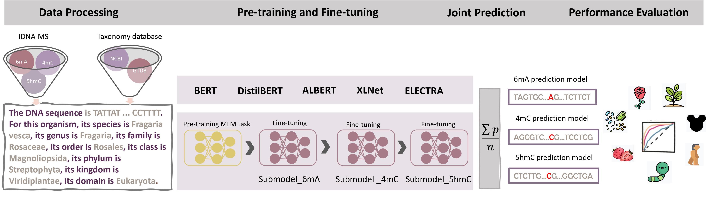

# MuLan-Methyl
This is the repository to 'MuLan-Methyl - Multiple Transformer-based Language Models for Accurate DNA Methylation Prediction', contained resources including source code for implementing MuLan-Methyl fine-tuning procedure and prediction on custom dataset.

Please kindly cite our paper if you use the model.


## Web service  

Web service for MuLan-Methyl is present at: http://ab.cs.uni-tuebingen.de/software/mulan-methyl 

## The MuLan-Methyl workflow

<div align="justify">The framework employs five fine-tuned language models for joint identification of DNA methylation sites. Methylation datasets (obtained from iDNA-MS) are processed as sentences that describe the DNA sequence as well as the taxonomy lineage, giving rise to the processed training dataset and the processed independent set. For each transformer-based language model, a custom tokenizer is trained based on a corpus that consists of the processed training dataset and taxonomy lineage data from NCBI and GTDB. Pre-training and fine-tuning are both conducted on each methylation- site specific training subset separately. During model testing, the prediction of a sample in the processed independent test set is defined as the average prediction probability of the five fine-tuned models. We thus obtain three methylation type-wise prediction models. We evaluated the model performance according to the genome type that contained in the corresponding methylation type-wise dataset, respectively. In total, we evaluated 17 combinations of methylation types and taxonomic lineages.</div> <br>


 

## Get started

### 1. Configuration
Download MuLan-Methyl from the github repository.
    
    git clone https://github.com/husonlab/mulan-methyl.git
    cd mulan-methyl

The needed data is stored in data.zip, with structure
```
├── benchmark
│   ├── example_data_processing
│   │   ├── test_set.tsv
│   │   └── train_set.tsv
│   ├── initial_dataset
│   │   ├── 4mC_C.equisetifolia
│   │   ├── 4mC_F.vesca
│   │   ├── 4mC_S.cerevisiae
│   │   ├── 4mC_Tolypocladium
│   │   ├── 5hmC_H.sapiens
│   │   ├── 5hmC_M.musculus
│   │   ├── 6mA_A.thaliana
│   │   ├── 6mA_C.elegans
│   │   ├── 6mA_C.equisetifolia
│   │   ├── 6mA_D.melanogaster
│   │   ├── 6mA_F.vesca
│   │   ├── 6mA_H.sapiens
│   │   ├── 6mA_R.chinensis
│   │   ├── 6mA_S.cerevisiae
│   │   ├── 6mA_T.thermophile
│   │   ├── 6mA_Tolypocladium
│   │   └── 6mA_Xoc BLS256
│   └── processed_dataset
│       ├── test
│       │   ├── processed_4mC.tsv
│       │   ├── processed_5hmC.tsv
│       │   └── processed_6mA.tsv
│       └── train
│           ├── processed_4mC.tsv
│           ├── processed_5hmC.tsv
│           └── processed_6mA.tsv
├── taxonomy
│   ├── ncbi_gtdb_processed.csv
│   └── species_name_mapped.csv
```

We recommand you to run MuLan-Methyl in a python virtual environemnt that built by [Anaconda](https://docs.anaconda.com/free/anaconda/install/index.html), build a new conda enviroment equipped with required packages.

    conda env create -n mulan-methyl --file MuLan.yaml
    conda activate mulan-methyl


### 2. Data processing (Skip this step if fine-tuning on iDNA-MS dataset which is used in our paper)
Input of MuLan-methyl is a sentence contains DNA seuqence and description of sample's taxonomic lineage. The following command give an example for processesing DNA sequence to the required format.

    python code/main.py \
            --data_proc \
            --input_file ./data/benchmark/example_data_processing/train.tsv \
            --data_type tsv \
            --labelled

### 3. Pretrained MuLan-Methyl
The pretrained MuLan-Methyl contains five pretrained language model, which are available on [Hugging Face](https://huggingface.co/wenhuan).

### 4. Fine-tuning
MuLan-Methyl contains three methylation-site type-wise prediction models, where 6mA prediction model ensemble five transformer-based language model, each is fine-tuned on the corresponding pretrained language model, sub-models of 4mC prediction model is fine-tuned on the 6mA fine-tuned models, similarly, sub-models of 5hmC prediction model is fine-tuned on the 4mC fine-tuned models.

Fine-tuning MuLan-Methyl for each methylation site by passing variable name 6mA, 4mC, 5hmC to argument methy_type, respectively.

This command give an example of fine-tuning MuLan-Methyl for identifying 6mA methylation site on the processed dataset.

    python code/main.py \
            --finetune \
            --input_file ./data/benchmark/processed_dataset/train/processed_6mA.tsv \
            --methyl_type 6mA \
            --model_list BERT DistilBERT ALBERT XLNet ELECTRA \
            --finetuned_output_dir ./pretrained_model


### 5. Methylation status prediction
After fine-tuning, using Mulan-Methyl to predict the methylation status on the DNA sequence. This command conduct 6mA methylation site prediction on R.chinensis.

    python code/main.py \
            --prediction \
            --input_file ./data/benchmark/processed_dataset/test/processed_6mA.tsv \
            --methyl_type 6mA \
            --labelled \
            --data_type tsv \
            --finetuned_output_dir ./pretrained_model \
            --multi_species \
            --species R.chinensis \
            --prediction_output_dir ./prediction


## Publication 
- Wenhuan Zeng, Anupam Gautam, Daniel H Huson. MuLan-Methyl - Multiple Transformer-based Language Models for Accurate DNA Methylation Prediction. preprint *bioRxiv*, **2023**. https://www.biorxiv.org/content/10.1101/2023.01.04.522704v1.full
