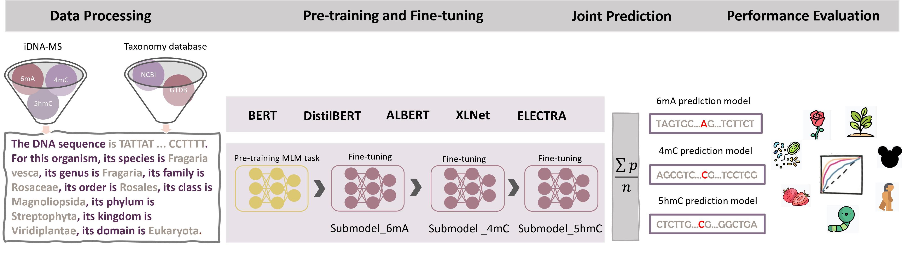

# MuLan-Methyl
MuLan-Methyl - Multiple Transformer-based Language Models for Accurate DNA Methylation Prediction.

The MuLan-Methyl workflow 
===========

 

**The MuLan-Methyl workflow:**
 The framework employs five fine-tuned language models for joint identification of DNA methylation sites. Methylation datasets (obtained from iDNA-MS) are processed as sentences that describe the DNA sequence as well as the taxonomy lineage, giving rise to the processed training dataset and the processed independent set. For each transformer-based language model, a custom tokenizer is trained based on a corpus that consists of the processed training dataset and taxonomy lineage data from NCBI and GTDB. Pre-training and fine-tuning are both conducted on each methylation- site specific training subset separately. During model testing, the prediction of a sample in the processed independent test set is defined as the average prediction probability of the five fine-tuned models. We thus obtain three methylation type-wise prediction models. We evaluated the model performance according to the genome type that contained in the corresponding methylation type-wise dataset, respectively. In total, we evaluated 17 combinations of methylation types and taxonomic lineages. 

Publication 
===========

- Wenhuan Zeng, Anupam Gautam, Daniel H Huson. MuLan-Methyl - Multiple Transformer-based Language Models for Accurate DNA Methylation Prediction. preprint *bioRxiv*, **2023**. https://www.biorxiv.org/content/10.1101/2023.01.04.522704v1.full

Web service                                                
===========
Web service for MuLan-Methyl is present at: http://ab.cs.uni-tuebingen.de/software/mulan-methyl 
